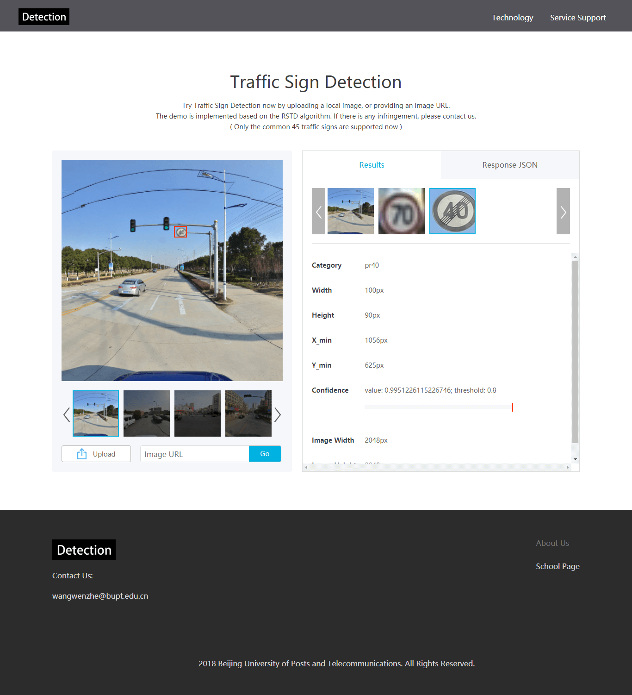

## RSTD Web Demo

A simply Regular and Small Target Detection demo running as a Flask web server.

The interface is as follows:



### Run

Running `python app.py` will bring up the demo server, accessible at `http://localhost:5000`.

```
Usage: python app.py [options]
Options:
  -d,        --debug       enable debug mode
  -g GPU_ID, --gpu=GPU_ID  choose gpu id
  -p PORT,   --port=PORT   choose service port
```
